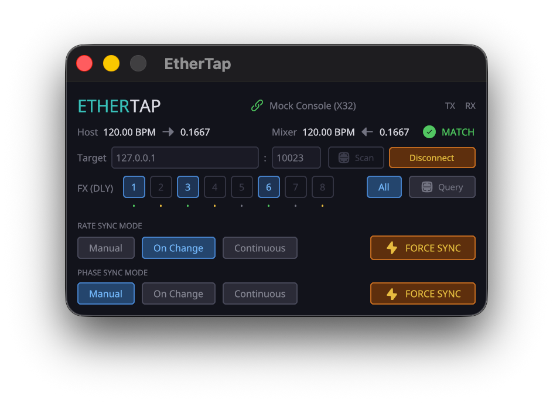

# EtherTap

**VST3 OSC bridge for Behringer X32 / Midas M32.**  
Keeps your mixer's delay time locked to the DAW BPM — automatically or on demand.



---

## What it does

EtherTap runs as a zero-audio VST3 plugin and talks to the mixer over UDP/OSC.  
When the host BPM changes, or on a manual trigger, it calculates the correct delay value and sends it to one or more Stereo Delay FX slots on the X32/M32.

**Rate sync** — updates the delay parameter derived from the current BPM.  
**Phase sync** — performs a hard reset: mute → set → unmute, removing residual echoes.

Both can fire on BPM change, on every beat, or only when you press the button.

---

## Install

Download the latest release from the [Releases](../../releases) page and copy the `.vst3`
bundle to your plugin folder:

| Platform | Folder |
|---|---|
| macOS | `~/Library/Audio/Plug-Ins/VST3/` |
| Windows | `C:\Program Files\Common Files\VST3\` |
| Linux | `~/.vst3/` |

---

## Connecting

1. Load the plugin in any track in your DAW.
2. Enter the mixer's IP address and port (`10023` is the X32/M32 default).
3. Press **Connect** — the status indicator turns green once the device responds.
4. Select which FX slot holds a Stereo Delay, or press **Query** to auto-detect.

EtherTap sends a heartbeat every 5 seconds. If the mixer stops responding it shows
a disconnected state and retries automatically every 2 seconds until it comes back.
Pressing **Disconnect** stops all retries.

---

## Sync modes

| Mode | Rate Sync | Phase Sync |
|---|---|---|
| **Manual** | Force button only | Force button only |
| **On Change** | After BPM settles for 500 ms | Hard reset at next beat boundary |
| **Continuous** | Every quarter-note beat | Hard reset every beat |

**Hard reset sequence:** mute → 75 ms → update delay → 75 ms → unmute.  
This re-anchors the hardware delay buffer and eliminates phase drift.

---

## Building from source

**Prerequisites:** Rust (stable), Git, `patch`

```sh
git clone <repo-url>
cd ethertap
./scripts/setup.sh                             # vendor baseview, apply patches
cargo run -p xtask -- bundle ethertap --release
# → target/bundled/ethertap.vst3
```

**macOS universal binary (Intel + Apple Silicon):**

```sh
rustup target add aarch64-apple-darwin x86_64-apple-darwin
./scripts/build.sh --universal
# → dist/ethertap-<version>-macos-universal.zip
```

---

## BPM ↔ delay float

The X32/M32 stores delay time as a normalised float `[0, 1]` where `1.0 = 3000 ms`.

```
delay_float = 20 / bpm     (e.g. 120 BPM → 0.1667)
bpm         = 20 / delay_float
```

---

## OSC reference

| Address | Dir | Type | Description |
|---|---|---|---|
| `/info` | TX | — | Heartbeat probe |
| `/fx/{n}/type` | TX | — | Query effect type (DLY = 10) |
| `/fx/{n}/par/02` | TX | `float` | Set / query delay time |
| `/fxrtn/{n}/mix/on` | TX | `int` | Mute (0) / unmute (1) FX return |

---

## Architecture

```
┌────────────────────────────────────────────────────────┐
│  Host / DAW                                            │
│  ┌─────────────────┐    ┌──────────────────────────┐  │
│  │  Audio Thread   │    │  GUI Thread (Iced editor) │  │
│  │  process()      │    │  Telemetry + controls     │  │
│  └────────┬────────┘    └──────────────┬────────────┘  │
└───────────┼─────────────────────────── │ ──────────────┘
            │ crossbeam_channel (bounded, lock-free)  │
            └──────────────┬─────────────────────────┘
                           ▼
               ┌───────────────────────┐
               │   NetworkWorker       │
               │   UDP  →  X32 / M32   │
               └───────────────────────┘
```

`process()` never allocates, blocks, or locks a contended mutex.  
All network I/O is delegated via bounded lock-free channels.

---

## License

[MIT](LICENSE)
