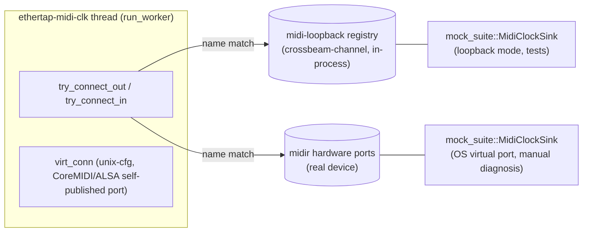

# Cross-platform MIDI clock

## Problem

`src/midi_clock.rs::MidiClockWorker::run()` dispatches to `run_unix()`
(`#[cfg(not(target_os = "windows"))]`) on macOS/Linux, and is a pure no-op
stub on Windows (`drop(output); log::warn!(...)`). Real users on Windows get
**no MIDI clock output at all**, even to a manually-selected device — the
`phys_out`/`phys_in` bridge logic in `run_unix` (connect to a user-picked
output port, forward 0xF8 pulses, passthrough non-clock bytes) never runs
there.

Separately, `tests/midi_clock_tests.rs` (`cfg(all(unix, not(feature =
"standalone")))`) drives this bridge against `mock_suite::MidiClockSink`, a
virtual MIDI **input** port opened via `midir::os::unix::VirtualInput`
(CoreMIDI on macOS, ALSA sequencer on Linux). On the `ubuntu-latest` GitHub
runner `/dev/snd/seq` doesn't exist, so `MidiClockSink::start_named()` fails
and the test panics (`"MIDI support could not be initialized"`). On Windows,
midir has no virtual-port backend at all, so this test can never run there
either — confirmed by `cargo check --target x86_64-pc-windows-gnu`.

## Goals / Non-goals

- **Goals:**
  - Windows and Linux users get a working MIDI clock bridge to a
    user-selected output device (the existing `phys_out`/`phys_in`/port-scan
    logic), not just macOS.
  - macOS keeps its native CoreMIDI behavior unchanged: publishing EtherTap's
    own discoverable "EtherTap MIDI Clock" virtual port (`virt_conn`),
    `set_realtime_priority` thread tuning, CoreMIDI device-watch.
  - `tests/midi_clock_tests.rs` runs and passes on macOS, Linux, and Windows
    CI — no dependency on `/dev/snd/seq` or any OS virtual-MIDI driver.
- **Non-goals:**
  - Shipping a virtual-MIDI kernel driver/loopMIDI-equivalent for Windows.
    Windows users who want EtherTap to appear as a source in another app
    still need a third-party loopback (e.g. loopMIDI) — out of scope.
  - Changing the RT audio-thread contract. `MidiClockWorker::run()` already
    executes on its own `ethertap-midi-clk` thread (`src/lib.rs`), not
    `process()` — no new RT-safety constraints apply here.
  - Fixing the unrelated Windows `harness_e2e` OSC-sync failure
    (`force_sync_rate_dispatches_osc_to_compatible_slots`) — separate
    follow-up.

## Approaches

| # | Approach | Pros | Cons |
|---|----------|------|------|
| A | CI-only fix: gate `midi_clock_tests.rs` back to `target_os = "macos"`, leave Windows `run()` as a no-op stub | Near-zero cost, unblocks CI | Doesn't fix the actual gap (no Windows MIDI output); Linux users also get nothing despite midir/ALSA working on real desktops |
| B | Cross-platform bridge for Windows/Linux production + keep `MidiClockSink` on real OS virtual ports, load `snd-seq`/`snd-virmidi` kernel modules in the ubuntu runner | Production fix is real; reuses existing sink code | `modprobe` needs `CAP_SYS_MODULE` in GH-hosted runners (unreliable/blocked); Windows e2e test still impossible (midir has zero virtual-port backend there) |
| C | Cross-platform bridge for Windows/Linux production + new tiny shared **in-process software MIDI loopback** crate, used by `MidiClockSink` and by the worker's connect path, so `tests/midi_clock_tests.rs` needs no OS MIDI driver on any platform | Satisfies all three goals; isolated to a small new crate + worker thread (not RT path); also gives macOS/Linux desktops the existing real-port path unchanged | New crate + refactor of `run_unix`'s ~270-line loop; must avoid name collisions between loopback and hardware ports |

## Recommendation

**Approach C.** It's the only option that makes Windows users' MIDI clock
actually work *and* gives Windows/Linux-without-ALSA-seq CI a real,
deterministic e2e MIDI path. The new crate (`midi-loopback` or similar:
process-global named-port registry over `crossbeam-channel`, already a dep
of both `ethertap` and `mock-suite`) is small and runs only on the
non-audio `ethertap-midi-clk` worker thread, so it doesn't touch the RT
contract in `CLAUDE.md`.

Shape:

- **`run_unix` → `run_worker`**, platform-neutral: `phys_out`/`phys_in`
  connect-by-name (`try_connect_out`/`try_connect_in`/`handle_port_scan`),
  device-change handling, clock-tick dispatch to `phys_out` — currently
  `#[cfg(not(target_os = "windows"))]`, becomes unconditional.
- **`virt_conn`** ("EtherTap MIDI Clock" self-published virtual port via
  `output.create_virtual(...)`) stays behind a unix-style cfg (see Open
  Questions) — this *is* "the native implementation" the user wants kept
  macOS-only-or-unix-as-today; on Windows it's simply never attempted
  (`virt_conn` is always `None`, no `midir::os::unix` import on that
  target).
- **`try_connect_out`/`try_connect_in`** consult the new loopback registry by
  name in addition to midir's hardware port enumeration — a registered
  loopback port and a hardware port are interchangeable from the worker's
  point of view.
- **`mock_suite::MidiClockSink`** gains a loopback-backed mode (or a sibling
  type) that registers a named port in the loopback registry instead of
  opening a real OS virtual input — used by `tests/midi_clock_tests.rs`,
  which drops its `cfg(unix)` gate (becomes `cfg(not(feature =
  "standalone"))` only).
- The existing OS-virtual-port `MidiClockSink` path (and the
  `list_ports`/`sink_loopback` examples that exercise it) stays for manual
  macOS/Linux-desktop diagnosis.

## Open questions

- **`virt_conn` cfg scope**: keep at `cfg(unix)` (today's behavior — macOS
  CoreMIDI works, Linux ALSA-seq works on real desktops and gracefully
  degrades to `None` in containers, Windows never attempts it), or narrow to
  `cfg(target_os = "macos")` per "keep the native implementation for macOS
  builds"? Recommend keeping `cfg(unix)` — it's already degrade-safe and
  gives Linux desktop users the extra virtual port for free — but flagging
  since the user's phrasing singles out macOS specifically.
- **Loopback registry crate name/location**: new workspace member
  (`midi-loopback` suggested) vs. a module inside an existing low-dependency
  crate. Spec author should check for an existing low-dep crate that both
  `ethertap` and `mock-suite` already depend on before adding a new member.
- **Message shape**: raw `&[u8]` byte slices (matches midir's callback
  signature) vs. a small enum — raw bytes are simplest and sufficient (the
  sink only inspects the first byte for `0xF8`).
