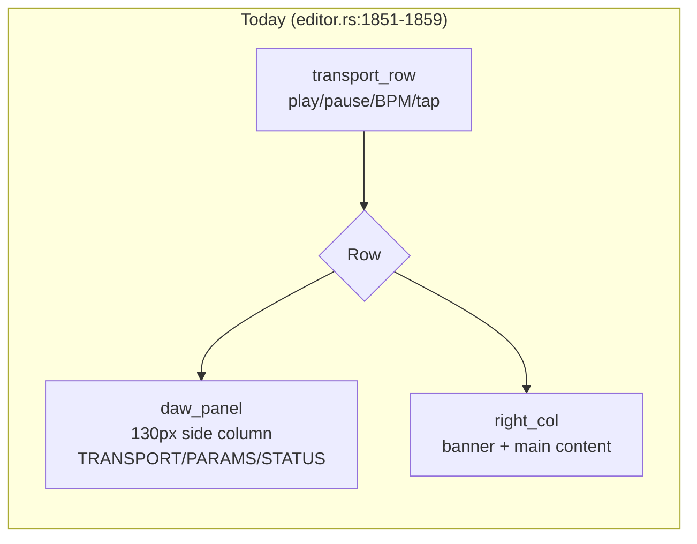

# DAW controls overhaul (standalone transport + MIDI)

## Problem

The standalone GUI's transport/DAW-I/O area has accumulated rough edges:

- The single play/stop button (`btn_play_stop`, `editor.rs:1700-1708`) only
  toggles `standalone_playing` — it never resets `standalone_pos_beats`. Users
  expect a *Stop* to rewind to zero; what exists today is really a *Pause*.
- A glyph at `editor.rs:1735,1779` (`\u{2669}` quarter note) is absent from
  `JetBrainsMono-Regular.ttf` — renders as a tofu/missing-glyph box in the
  transport row.
- The `daw_panel` (`editor.rs:1752-1843`) is a cramped 130px side column that
  widens the standalone window relative to VST3 mode (500×340 vs 360×280 per
  `signals.md`) and crams TRANSPORT/PARAMS/STATUS into an unreadable stack.
- MIDI device connection is manual-only — no auto-connect parallel to the
  mixer's `connect_to_last` / hot-plug reconnect path.
- MIDI status is partially surfaced (`bridge_status` dot, `midi_clk_btn`
  Enable/Active/Connecting at `editor.rs:1448-1472`) but not consistently, and
  there's no way to disable MIDI clock output once a device is selected beyond
  toggling the same button that also triggers connection.

## Goals / Non-goals

**Goals:**
- Split transport into Pause (toggle, no reset — today's behavior) and Stop
  (toggle off + reset position to zero).
- Fix the missing glyph.
- Replace the side `daw_panel` column with a footer band that (a) keeps
  standalone window width consistent with the VST3 layout philosophy and
  (b) shows the plugin's host-visible surface — primarily the automatable
  `EtherTapParams` (what the DAW's automation lanes / generic editor would
  show), with room for a few I/O/connection facts alongside.
- Lay the footer out with a small dynamic wrap/grid so the param count can
  change without hand-placing each widget.
- Add a MIDI auto-connect toggle that mirrors the mixer's reconnect posture:
  attempts connection on startup and on hot-plug (new device detected via
  `midi_watcher`), using the existing `Backoff`-driven retry path already in
  `midi_clock.rs::handle_port_scan` (`midi_clock.rs:583-637`).
- Make MIDI status legible at a glance (connected / connecting / disconnected,
  clock enabled/disabled) using the same dot+label idiom as OSC sync
  (`sync_dot`/`conn_dot`, `editor.rs:1745-1748,1824-1835`), and give the user
  an explicit way to disable MIDI clock output.

**Non-goals:**
- No new audio-thread allocation or blocking — `process()` stays untouched
  beyond reading the existing/new atomics (RT-safety contract in `CLAUDE.md`).
- No redesign of the OSC/mixer side of the UI — only mirroring its idioms.
- No general-purpose reusable layout component — the wrap/grid is scoped to
  this footer (per user direction: "simple dynamic wrap/grid", not a new
  abstraction for hypothetical future panels).
- No change to which params are automatable or their `#[id]` wiring in
  `params.rs` — the footer *displays* the existing surface, it doesn't grow it.
- VST3 (non-standalone) editor layout is unaffected — this is gated by
  `#[cfg(feature = "standalone")]` same as today's `daw_panel`.

## Current state — transport & DAW panel

*Side panel widens the standalone window vs. VST3's fixed-width layout.*

## Approaches — footer content & layout

| # | Approach | Pros | Cons |
|---|----------|------|------|
| A | Hand-placed sections (status quo, just relocated to footer row) | Minimal code change; matches existing `daw_panel` groupings | Doesn't address "organized neatly" — still brittle to param-count changes; user explicitly asked for something less ad-hoc |
| B | Iterate `EtherTapParams`' `#[id]` fields + a few connection facts, lay out via a wrap/grid that flows N-per-row based on available width | Self-adjusting as params are added/removed; directly answers "what the DAW sees"; matches user's stated direction | Needs a small layout helper inside `editor.rs` (not a new module — scoped per non-goals) |
| C | Full generic param-introspection panel mirroring nih-plug's generic editor | Maximally "universal" | Overkill — user explicitly said "simple… scoped to this footer", not a reusable component |

## Recommendation

**Approach B.** Build the footer around the automatable param set already
defined in `params.rs:84-127` (`rate_sync_mode`, `phase_sync_mode`,
`connect_to_last`, `disconnect`, `force_sync_*`, `is_connected`, `is_matched`)
— ten `#[id]`-tagged fields, a small enough set that a simple wrapping
row/grid (fixed-width chips, `Row` that breaks into a new `Row` past N items
or past a width budget) covers it without new abstraction. Show name + current
value/state per param using the existing dot/label idiom. Add 1-2 connection
facts (target/connected, hw BPM) alongside, consistent with what
`telem_row`/`daw_panel STATUS` already display today (`editor.rs:1398-1414,
1822-1840`) — reuse those value sources rather than inventing new state.

This keeps the standalone window width anchored to the VST3 layout (the footer
spans full width, doesn't add a side column) and gives the param surface a
predictable, count-driven layout instead of a hand-stacked column.

## MIDI auto-connect — approaches

| # | Approach | Pros | Cons |
|---|----------|------|------|
| A | New `#[persist]` `AtomicBool` (e.g. `midi_auto_connect`) read by `midi_clock.rs`'s device-change handler (`midi_clock.rs:504-526`) and port-scan (`midi_clock.rs:583-637`); when true and no device selected, auto-pick first available and `try_connect_out/in()` through the existing `Backoff` | Mirrors `connect_to_last` (`params.rs:95-96`) exactly; reuses the retry/backoff machinery already proven for the mixer and for MIDI port-scan reconnects; minimal new surface | Needs the toggle plumbed editor → worker via the existing `MidiWatcherChannels`/command pattern |
| B | Always-on auto-connect (no toggle) | Less UI surface | Removes user control — contradicts "decent interface… leave the system working in bg" framing, which implies the user wants visibility + control, not silent automation (echoes the project's "No surprise automation" philosophy in `CLAUDE.md`) |

## Recommendation

**Approach A.** A persisted toggle (`#[persist]`, mirroring `midi_clock_enabled`
at `params.rs:68-69`) read by the existing port-scan/device-change handlers in
`midi_clock.rs`. Trigger conditions: startup (first port scan after device list
populates) **and** hot-plug (new device appears in `editor_rx`/`worker_rx` from
`midi_watcher.rs:35-44`) — both paths already funnel through
`handle_port_scan` (`midi_clock.rs:583-637`), so auto-connect is a guard added
at the "device present, none selected" branch rather than a new mechanism.
This is the smallest change that produces DAW-parity behavior with
`connect_to_last`, and keeps with "no surprise automation": the toggle is
explicit, OFF by default, and its state is visible.

## Status indicators — approach

Reuse the existing dot+label idiom verbatim
(`bridge_status`/`bridge_dot`/`bridge_color`, `editor.rs:1440-1449`; `sync_dot`/
`conn_dot`, `editor.rs:1745-1748`). The pieces mostly exist — `midi_clk_btn`
already encodes Enable/Active/Connecting/Enabled state (`editor.rs:1451-1472`).
The gap is consistency and a disable affordance: today the only way to stop
MIDI clock output is to toggle the same control that also drives connection.
Add a clear "disabled vs. enabled-but-disconnected vs. connected vs.
connecting" state ladder, surfaced the same place the auto-connect toggle
lives, so a user can see *and* control MIDI clock state without hunting.

## Stop vs. Pause

Today's `btn_play_stop` (`editor.rs:1700-1708`,
`Message::ToggleStandalonePlay` at `editor.rs:858-861`) becomes **Pause**
(unchanged behavior — flips `standalone_playing`, leaves
`standalone_pos_beats` untouched). A new **Stop** control must end with
`standalone_playing == false` and `standalone_pos_beats == 0`.

**Important — not a plain cross-thread store.** `process()` performs a
read-modify-write on `standalone_pos_beats` every buffer while playing
(`lib.rs:794-804`: loads, adds `beats_this_buf`, stores back, all
`Ordering::Relaxed`). An editor-thread `store(0)` racing against this
read-modify-write can be silently clobbered — the audio thread may observe a
stale `playing == true` and a stale pre-reset position within the same buffer
window the editor is mutating, and write back `old_pos + delta`, overwriting
the editor's zero. Relaxed atomics provide no ordering guarantee between two
independent editor-thread stores landing before the audio thread observes
them.

The codebase already has the right idiom for "editor requests, audio thread
performs": `force_sync_trigger`/`force_rate_trigger`
(`Arc<AtomicBool>`, `editor.rs:482-483`, consumed via `swap(false)` —
documented in `CLAUDE.md`'s Inter-Thread Communication table as the standard
"editor → audio, swap(false) to consume" pattern). Stop should follow the same
shape: a one-shot trigger atomic the editor sets, which `process()` consumes
(via `swap(false, Ordering::Relaxed)`) **unconditionally each buffer in its
standalone branch — checked independently of, and before, the `playing` gate
at `lib.rs:794`** (a Stop pressed while already paused must still zero the
position; gating consumption on `playing` would silently swallow that case).
On a positive swap, `process()` performs the
`standalone_pos_beats.store(0.0f64.to_bits(), …)` itself, serialized with its
own accumulation logic, so no race window exists. This is a `process()`
change, but a small, RT-safe one consistent with existing patterns — not new
allocation, not a lock, not blocking I/O.

Stop does **not** add any new suppression of downstream MIDI clock / OSC sync
— those already react to `standalone_playing == false` the same way Pause
leaves them (per user decision: "Stop = pause-at-zero").

## Glyph fix

Replace `\u{2669}` at `editor.rs:1735,1779` with a glyph present in either
font already loaded — `icon::CLOCK` (`U+ED1C`, confirmed present in
`Solar-Icon-Set_Bold.ttf`'s cmap) is the closest semantic fit (it already
labels the MIDI clock control at `editor.rs:1464`), or a simpler ASCII/box
character confirmed present in `JetBrainsMono-Regular.ttf`. Final glyph choice
left to the implementer — the contract is "no missing-glyph box," not a
specific codepoint.

## Open questions

- Exact footer wrap/grid mechanics (items-per-row vs. width-budget breaking) —
  left to the implementer; `iced` 0.x (vendored, stateful-widget API per
  `CLAUDE.md`) has no built-in wrap container, so this will be a small
  `Row`-of-`Row`s chunking helper. Not pre-designing the chunking formula here
  — that's an implementation detail, not a contract.
- Which 1-2 connection/I/O facts join the param list in the footer (target
  IP:port? hw BPM? device name?) — implementer picks from the values already
  computed for `telem_row`/`daw_panel STATUS`, matching "directly what the DAW
  sees" as closely as the existing data allows.
