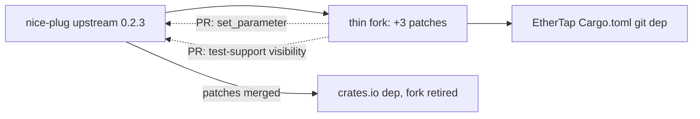

# nice-plug migration

## Problem

EtherTap builds against a vendored nih-plug (pinned `28b149e`) plus vendored baseview and a copypasta shim — 17 patch files across two vendor clones, reapplied by `scripts/setup.sh` on every vendor refresh. Upstream nih-plug is officially in maintenance mode (README points to the community fork); its tip is 4 cosmetic commits past our pin, so tracking upstream buys nothing. The patch treadmill is pure maintenance cost with a dead upstream.

Migration target (decided 2026-08-04, re-verified 2026-08-05): **nice-plug 0.2.3** (`codeberg.org/RustAudio/nice-plug`, RustAudio/BillyDM fork, maintainer-endorsed). Active releases, edition 2024, iced 0.14 Elm-style adapter, baseview 0.2 from crates.io, rwh 0.6 unified.

## Goals / Non-goals

- Goals:
  - Depend on nice-plug from crates.io or a thin git fork — delete `vendor/`, `patches/`, the setup.sh patch dance, and the copypasta shim.
  - Preserve the full host-visible param surface and all runtime behavior (params, telemetry readback, momentary triggers, standalone mode).
  - Keep the vst-runtime test harness working (Transport construction/positioning, host-style param sets).
  - Shrink remaining patch delta toward zero via upstream PRs (fork accepts them).
- Non-goals:
  - GUI redesign. The iced 0.14 rewrite reproduces the existing 360×280 layout and standalone chrome as-is.
  - New plugin formats (CLAP/AU). VST3 only, as today.
  - Changing sync/telemetry semantics ("Status-Aware Proxy" philosophy untouched).
  - Migrating shimmers or unifying its stack (its vizia-plug pin is its own problem).

## Evidence (2026-08-05)

| Fact | Source |
|------|--------|
| nice-plug 0.2.3 latest (2026-07-29); 0.2.0 broke: `dpi`-crate sizing, `tracing` logging, baseview 0.2, rwh 0.6 | crates.io API, CHANGELOG.md |
| `ProcessContext::set_parameter` still TODO-commented at nice-plug tip | `crates/nice-plug-core/src/context/process.rs` (fetched) |
| `set_parameter` used at 14 audio-thread call sites: 8 telemetry/status params + 5 momentary self-resets + 1 audit retrigger | `src/lib.rs:629-704`, `src/lib.rs:1021-1072` |
| vst-runtime harness needs `Transport::new()` (pub), `Transport::set_song_position()`, `ParamPtr::set_normalized_value()`/`update_smoother()` (pub) | `vst-runtime/src/lib.rs:21,242-248,357-359,445-446` |
| baseview patches (9 files: `open_as_if_parented`, ARM64 crash guard, `setFrameSize:` relay, rwh bridging) all target problems nice-plug's baseview 0.2 stack solves upstream | patch inventory; nice-plug 0.2 CHANGELOG |
| editor.rs: 2798 LOC, 24 stateful widget fields, 23 Message variants, 14 StyleSheet impls — all on retired iced 0.4 stateful API | editor inventory |
| vizia-plug (shimmers' GUI): last commit 2026-06-13, pins `nice-plug-core 0.1.4`, incompatible with nice-plug 0.2.x | GitHub API |

## Approaches

### GUI adapter

| # | Approach | Pros | Cons |
|---|----------|------|------|
| G-A | **nice-plug-iced** (in-tree, iced 0.14) | Version-locked to nice-plug releases; same framework family as current GUI (smallest conceptual delta); can't drift | Full mechanical rewrite of editor.rs (stateful → Elm-style) |
| G-B | vizia_plug (shimmers' stack) | One GUI stack across both projects | Third-party, stale since June, pins nice-plug-core 0.1.4 — blocks nice-plug 0.2.x entirely; total paradigm change (reactive + CSS) |
| G-C | nice-plug-egui | In-tree, immediate-mode simplicity | Paradigm change; look/feel rebuild from scratch |

### Patched-API strategy (`set_parameter` + harness visibility)

| # | Approach | Pros | Cons |
|---|----------|------|------|
| P-A | Pure crates.io + full atomics refactor: demote 8 telemetry params to atomics, momentary triggers to AtomicBool | Zero patches, zero fork | Removes 8 params from host surface — user-visible regression (DAW param list, saved sessions); largest src/lib.rs churn; harness still blocked on Transport/ParamPtr visibility |
| P-B | **Thin git fork**: fork nice-plug, apply 3 small patches (ProcessContext::set_parameter + VST3 impl; Transport visibility + set_song_position; ParamPtr pub), depend via `git = <fork>`; upstream each patch as a PR | Zero behavior change; kills vendor/ + setup.sh + baseview + copypasta anyway; delta shrinks to zero as PRs land; rebase is `git rebase`, not patch reapply | Fork must be rebased on nice-plug releases until PRs land; needs a hosting location |
| P-C | Vendor nice-plug locally (today's model, new upstream) | Familiar workflow | Keeps the entire patch treadmill this migration exists to kill |

## Recommendation

**G-A + P-B: nice-plug 0.2.3 via a thin git fork carrying 3 patches, GUI on nice-plug-iced.**

- The fork's 3 patches replace today's 17 across two vendors plus a shim crate; baseview vendoring disappears entirely because nice-plug 0.2 uses crates.io baseview 0.2 with rwh 0.6 (the ARM64 guard, `open_as_if_parented`, and resize-relay problems our patches solved are handled upstream — verify at standalone checkpoint).
- Preserving the param surface (P-B) beats the atomics refactor (P-A): the 8 telemetry params are host-visible product surface, and the existing `set_parameter` patch is already written and battle-tested — porting it to a fork commit is cheaper and safer than rewriting 14 call sites and regressing DAW-side status visibility.
- nice-plug-iced (G-A) because in-tree adapters can't lag their framework; vizia-plug's `nice-plug-core 0.1.4` pin is a live demonstration of why third-party adapters lose.
- Upstreaming: `set_parameter` fills an acknowledged TODO; Transport/ParamPtr visibility can be proposed as a `test-support`-gated feature. Fork accepts PRs (verified 2026-08-04).

Migration flow — fork feeds the build while PRs drain the delta:

## Open questions

- Fork hosting: mirror to the user's GitHub (`gh` available, lowest friction) or keep on Codeberg next to upstream? Assumed GitHub unless overridden.
- Upstream PR submission needs the user's Codeberg identity — batch both PRs after the migration lands, or file early so the fork retires sooner?
- baseview 0.2 standalone behavioral parity (window embedding, live resize, ARM64) is asserted from changelog evidence, not tested — verified empirically at the standalone checkpoint; fallback is fixing via the same fork.
