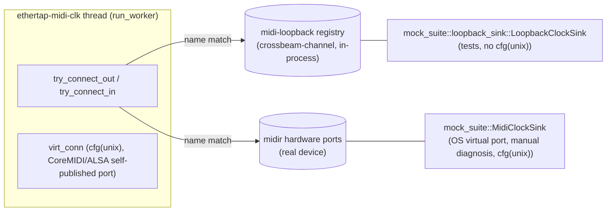

# Cross-platform MIDI clock

## Goal

Windows and Linux users get a working MIDI clock bridge (`phys_out`/`phys_in`
connect-by-name, port scan, 0xF8 dispatch, passthrough) to a user-selected
output device — currently this entire path is `#[cfg(not(target_os =
"windows"))]` and Windows gets a no-op stub. macOS/Linux native behavior
(`virt_conn` self-published "EtherTap MIDI Clock" virtual port, RT thread
priority, CoreMIDI device-watch) stays unchanged. `tests/midi_clock_tests.rs`
runs and passes on macOS, Linux, and Windows CI without depending on
`/dev/snd/seq` or any OS virtual-MIDI driver, via a new in-process software
MIDI loopback shared between the worker and `mock_suite::MidiClockSink`.

## Non-goals

- No virtual-MIDI kernel driver / loopMIDI-equivalent for Windows. Windows
  users who want EtherTap to appear as a MIDI source in another app still
  need third-party loopback software — out of scope.
- No change to the RT audio-thread contract. `MidiClockWorker::run()` already
  executes entirely on the `ethertap-midi-clk` worker thread (`src/lib.rs`),
  not `process()`. This work touches only that worker thread and a new
  non-RT crate — no new constraints on `process()`, and implementers must not
  introduce any (no allocation/blocking added to `process()`).
- No fix for the unrelated Windows `harness_e2e::force_sync_rate_dispatches_osc_to_compatible_slots`
  failure — separate follow-up.
- No change to `virt_conn` cfg scope beyond what's already true today: it
  stays `cfg(unix)` (macOS CoreMIDI + Linux ALSA-seq, degrades to `None` in
  containers; never attempted on Windows).

## Success criteria

1. `cargo test --workspace` passes on macOS (current dev platform), including
   the existing `src/midi_clock.rs` unit tests (`compute_stats_*`,
   `backoff_*`, `handle_port_scan_*`, `clock_stats_default`) and the new
   `midi-loopback` crate's unit tests.
2. `tests/midi_clock_tests.rs::clock_ticks_reach_virtual_sink_with_zero_drops`
   passes on macOS using the new loopback-backed `MidiClockSink` path (not
   the OS virtual port), and its `cfg` gate is `cfg(not(feature =
   "standalone"))` only — no `unix` requirement.
3. `cargo check --workspace --all-targets --target x86_64-pc-windows-gnu`
   typechecks cleanly with `run_worker` called unconditionally from
   `MidiClockWorker::run()` (no `#[cfg(not(target_os = "windows"))]` /
   `#[cfg(target_os = "windows")]` split on the bridge logic). `virt_conn`
   remains absent on Windows (no `midir::os::unix` import on that target —
   confirm via `grep` that `os::unix` usages stay inside `cfg(unix)` blocks).
4. `cargo check --workspace --all-targets --target x86_64-unknown-linux-gnu`
   typechecks cleanly (ALSA/X11 pkg-config link errors are pre-existing and
   out of scope for this check — typecheck only, per the technique already
   used in this session for the lint job).
5. On macOS, `cargo run -p mock-suite` (TUI) and
   `cargo run --example sink_loopback` / `list_ports` (if present) continue
   to exercise the existing OS-virtual-port `MidiClockSink` path for manual
   diagnosis — i.e. the OS-virtual-port code path is not deleted, only
   supplemented.
6. Real macOS behavior unchanged: `virt_conn` still publishes "EtherTap MIDI
   Clock" via `output.create_virtual(...)` under `cfg(unix)`, RT thread
   priority (`set_realtime_priority`, macOS-only) still applies, device-watch
   notification path still drives `handle_port_scan`.
7. `cargo clippy --workspace --all-targets -- -D warnings` and `cargo fmt
   --check` pass on macOS for all touched crates.

## Approaches

| # | Approach | Pros | Cons |
|---|----------|------|------|
| A | CI-only fix: gate `midi_clock_tests.rs` back to `target_os = "macos"`, leave Windows `run()` as a no-op stub | Near-zero cost, unblocks CI | Doesn't fix the actual gap (no Windows MIDI output); Linux users also get nothing despite midir/ALSA working on real desktops |
| B | Cross-platform bridge for Windows/Linux production + keep `MidiClockSink` on real OS virtual ports, load `snd-seq`/`snd-virmidi` kernel modules in the ubuntu runner | Production fix is real; reuses existing sink code | `modprobe` needs `CAP_SYS_MODULE` in GH-hosted runners (unreliable/blocked); Windows e2e test still impossible (midir has zero virtual-port backend there) |
| C | Cross-platform bridge for Windows/Linux production + new tiny shared **in-process software MIDI loopback** crate, used by `MidiClockSink` and by the worker's connect path, so `tests/midi_clock_tests.rs` needs no OS MIDI driver on any platform | Satisfies all three goals; isolated to a small new crate + worker thread (not RT path); also gives macOS/Linux desktops the existing real-port path unchanged | New crate + refactor of `run_unix`'s ~270-line loop; must avoid name collisions between loopback and hardware ports |

## Recommendation

**Approach C.**

Shape:

- **`run_unix` → `run_worker`**, platform-neutral: `phys_out`/`phys_in`
  connect-by-name (`try_connect_out`/`try_connect_in`/`handle_port_scan`),
  device-change handling, clock-tick dispatch to `phys_out`/loopback —
  currently `#[cfg(not(target_os = "windows"))]`, becomes unconditional.
  `MidiClockWorker::run()` calls `run_worker` directly, dropping the
  Windows-stub branch entirely.
- **`virt_conn`** ("EtherTap MIDI Clock" self-published virtual port via
  `output.create_virtual(...)`) stays behind `cfg(unix)` — unchanged from
  today. On Windows it's simply never attempted (`virt_conn` is always
  `None`, no `midir::os::unix` import on that target).
- **`try_connect_out`/`try_connect_in`** consult the new `midi-loopback`
  registry by name in addition to midir's hardware port enumeration — a
  registered loopback port and a hardware port are interchangeable from the
  worker's point of view.
- **`mock-suite` gains a new, ungated `loopback_sink` module** with a sibling
  type (e.g. `LoopbackClockSink`) that registers a named port in the
  `midi-loopback` registry and reuses the existing `SinkState`/stats
  accumulation logic — used by `tests/midi_clock_tests.rs`, which drops its
  `cfg(unix)` gate down to `cfg(not(feature = "standalone"))` only. This
  module has no `midir`/unix dependency, so it compiles on Windows.
- The existing OS-virtual-port `MidiClockSink` (`clock_sink.rs`, `cfg(unix)`)
  stays unchanged for manual macOS/Linux-desktop diagnosis (TUI, headless
  examples, `list_ports`/`sink_loopback`).

### Resolved decisions

1. **`virt_conn` cfg scope**: keep `cfg(unix)` — today's behavior, no change.
2. **Loopback crate**: new workspace member **`midi-loopback`** at repo root
   alongside `xtask`/`vst-runtime`/`mock-suite`. Becomes a normal dependency
   of both `ethertap` and `mock-suite`. No existing low-dep crate fits:
   `mock-suite` has no dependency relationship with `ethertap` in either
   direction today. `crossbeam-channel` 0.5 is already a workspace dep
   (root `Cargo.toml` and `mock-suite/Cargo.toml` would each gain
   `midi-loopback = { path = "midi-loopback" }`; `midi-loopback` itself
   depends only on `crossbeam-channel` + `parking_lot` for the registry).
3. **Message shape**: raw bytes, `Vec<u8>` per message over
   `crossbeam_channel`. Matches midir's callback signature
   (`&[u8]`/`Vec<u8>`) and the sink only inspects `message.first()` for
   `0xF8` — no enum needed.

## Checkpoints

| # | Checkpoint | Files/areas | Agent | Est. files | Verifies |
|---|------------|--------------|-------|------------|----------|
| 1 | New `midi-loopback` crate: process-global named-port registry (`register`/`connect`/`send`/`recv` over `crossbeam_channel::bounded::<Vec<u8>>`), unit tests for register/connect/send-recv/unregister/name-collision. Add to workspace `members` in root `Cargo.toml`. | `midi-loopback/Cargo.toml`, `midi-loopback/src/lib.rs`, root `Cargo.toml` (`members`) | atomic-builder | 3 | `cargo test -p midi-loopback` green; registry unit tests cover register/connect/send/recv/unregister/collision (criterion 1) |
| 2 | `src/midi_clock.rs`: rename `run_unix` → `run_worker`, drop `#[cfg(not(target_os = "windows"))]`/`#[cfg(target_os = "windows")]` split so `run_worker` is unconditional and `MidiClockWorker::run()` calls it directly (Windows stub branch removed). Keep `virt_conn` block under `cfg(unix)`. `try_connect_out`/`try_connect_in` consult `midi-loopback` registry (by name) in addition to midir hardware enumeration — registry lookup first or merged into the port-name search, loopback ports interchangeable with hardware ports. `handle_port_scan` becomes unconditional too (drop its `cfg(not(target_os = "windows"))`). Add `midi-loopback` as a normal dep of `ethertap` in root `Cargo.toml`. | `src/midi_clock.rs`, root `Cargo.toml` (`[dependencies]`) | atomic-builder | 2 | `cargo test --workspace` green on macOS (existing unit tests `compute_stats_*`, `backoff_*`, `handle_port_scan_*` now run unconditionally — remove their `cfg(not(target_os = "windows"))` test-helper gates too); `cargo check --workspace --all-targets --target x86_64-pc-windows-gnu` succeeds (criterion 3); `cargo check ... --target x86_64-unknown-linux-gnu` succeeds (criterion 4) |
| 3 | `mock-suite`: new ungated `loopback_sink` module with a sibling type `LoopbackClockSink` (e.g. `start_named`) that registers a named port in `midi-loopback` instead of opening `midir::os::unix::VirtualInput`, reusing the existing `SinkState`/stats accumulation logic against bytes received from the loopback `recv` side. `SinkState` is currently private and local to `clock_sink.rs` (`#![cfg(unix)]`), so it must first be extracted (with the 0xF8-counting/jitter-stat computation) into a small shared ungated location — e.g. a new `mock-suite/src/sink_state.rs` module, or alongside the already-shared `SinkStats` in `lib.rs` — that both `clock_sink.rs` and `loopback_sink.rs` depend on; no duplication. No `#![cfg(unix)]`, unconditional `pub mod loopback_sink` in `lib.rs` — compiles on all platforms, no `midir`/unix dependency. Existing OS-virtual-port `MidiClockSink` (`clock_sink.rs`, `cfg(unix)`) untouched apart from this extraction. Add `midi-loopback` as a normal dep of `mock-suite`. | `mock-suite/src/loopback_sink.rs` (new), `mock-suite/src/sink_state.rs` (new, or extraction target in `lib.rs`), `mock-suite/src/clock_sink.rs`, `mock-suite/src/lib.rs`, `mock-suite/Cargo.toml` | atomic-builder | 4 | `cargo build -p mock-suite` and `cargo test -p mock-suite` green; `loopback_sink` compiles on all platforms (no `cfg(unix)`); `clock_sink.rs` reuses the extracted `SinkState`/stats logic without duplication |
| 4 | `src/midi_clock.rs` + `midi-loopback`: CP2's loopback consult covers only the *connect* path (`try_connect_out`/`try_connect_in`). The periodic port-scan timer's presence check (`handle_port_scan`'s `ports_now`, built from `midir::MidiOutput::new("EtherTap-Scan").ports()`) cannot see loopback-registered names, so ~1s after a loopback connection succeeds, `handle_port_scan`'s `!present && phys_out.is_some()` branch disconnects it again. Add a names-listing fn to `midi-loopback` (e.g. `registered_names() -> Vec<String>`) and union it into `ports_now` (or have `handle_port_scan`'s presence check OR against it), so a connected loopback port is never reported as "disappeared" by the scan timer. | `midi-loopback/src/lib.rs`, `src/midi_clock.rs` | atomic-builder | 2 | `cargo test --workspace` green; a test exercising `handle_port_scan` (or the full select-loop) with a registered loopback port confirms `phys_out` stays connected across a scan tick |
| 5 | `tests/midi_clock_tests.rs`: drop `cfg(all(unix, not(feature = "standalone")))` to `cfg(not(feature = "standalone"))`; switch from `mock_suite::MidiClockSink::start_named` to `mock_suite::loopback_sink::LoopbackClockSink::start_named` (CP3) so the worker connects via `midi-loopback` registry instead of a real OS virtual port. | `tests/midi_clock_tests.rs` | atomic-surgeon | 1 | `cargo test --test midi_clock_tests` green on macOS via loopback path (criterion 2); `cargo check --workspace --all-targets --target x86_64-pc-windows-gnu` and `--target x86_64-unknown-linux-gnu` succeed with the test compiling (criteria 3, 4) |

Each checkpoint ends green: `cargo test --workspace` (or the scoped `-p`/`--test` variant shown) plus `cargo clippy --workspace --all-targets -- -D warnings` and `cargo fmt --check` on macOS.

## Risks

| Risk | Mitigation |
|------|------------|
| Loopback and hardware ports collide on name (a real device named e.g. "EtherTap Test Sink ...") | Loopback/test ports are namespaced distinctly by convention: they use the fixed test-only `"EtherTap Test Sink {pid}"` name (PID-unique, per `tests/midi_clock_tests.rs`, and matching the existing `SINK_PORT_NAME`/`"EtherTap Mock MIDI Sink"` convention in `clock_sink.rs`) — no real hardware device is ever named this. Collision is a non-issue by construction, not just "in practice"; lookup order in `try_connect_out`/`try_connect_in` (registry-first vs. merged) is left as implementer choice |
| Removing `cfg(not(target_os = "windows"))` from `handle_port_scan`/`try_connect_*` exposes a Windows-only midir API gap (e.g. `midir::os::unix::VirtualOutput` accidentally referenced outside `cfg(unix)`) | CP2 explicitly audits for stray `os::unix` imports; criterion 3's `cargo check --target x86_64-pc-windows-gnu` is the gate |
| `midi-loopback` registry needs to be a singleton across `ethertap` and `mock-suite` processes/threads but they're separate crates in the same binary (integration test) — global state via `OnceLock`/`static` must not race with test parallelism | CP1 unit tests cover register/unregister cleanly; CP4 test already serializes via `E2E_LOCK` (existing harness convention in `tests/common/mod.rs`) |
| New crate adds workspace build time / CI matrix surface | Crate is tiny (registry + tests only, no heavy deps beyond `crossbeam-channel`/`parking_lot` which are already workspace deps) — negligible |
| `cargo fmt --check` / clippy regressions from removing cfg-gated code blocks (now-unreachable `#[allow(...)]` attributes, unused imports) | Each checkpoint runs `cargo clippy --workspace --all-targets -- -D warnings` and `cargo fmt --check` as part of its green-build gate |

## Change log

### 2026-06-14 — Insert CP4 (loopback presence-check fix)

**What changed:** Inserted a new CP4 (`midi-loopback/src/lib.rs`,
`src/midi_clock.rs`, atomic-builder, 2 files): add a names-listing fn to
`midi-loopback` (e.g. `registered_names() -> Vec<String>`) and union it into
`handle_port_scan`'s `ports_now` presence check. The former CP4 (test rewire
of `tests/midi_clock_tests.rs`) is renumbered to CP5, with its `Agent` column
changed from `atomic-builder` to `atomic-surgeon` (1-file mechanical edit,
unchanged from its original scope).

**Why:** CP5's edits (made first, ahead of the new CP4) failed at runtime —
`clock_ticks_reach_virtual_sink_with_zero_drops` got "got 11" clocks instead
of the required ≥48. Root cause: CP2's loopback-registry consult covers only
the connect path (`try_connect_out`/`try_connect_in`); the periodic
port-scan timer's presence check (`handle_port_scan`'s `ports_now`, built
from real midir hardware enumeration only) cannot see loopback-registered
names, so ~1s after a loopback connection succeeds, `handle_port_scan`'s
`!present && phys_out.is_some()` branch disconnects it again. This blocks
spec success criterion 2. No prior checkpoint covered this — CP4 is new
work, not a correction of CP1-3.

### 2026-06-14 — Correction: `run()` aborted the whole bridge when no ALSA seq device

**What changed:** `MidiClockWorker::run()` (`src/midi_clock.rs`) no longer
treats `midir::MidiOutput::new("EtherTap")` failure as fatal. `run_worker`'s
`output` parameter is now `Option<midir::MidiOutput>`; `run()` maps an `Err`
to `None` (logs a warning) instead of `return`ing early, and always calls
`run_worker`. The `cfg(unix)` `virt_conn` block becomes
`output.and_then(|output| ...)`, yielding `None` when no output handle is
available.

**Why:** Live CI on PR #6 (run `27498130572`, `Test / ubuntu-latest`) failed
`clock_ticks_reach_loopback_sink_with_zero_drops` with "MIDI worker never
connected to the loopback sink port". Root cause: ubuntu-latest GitHub
runners have no `/dev/snd/seq`, so `MidiOutput::new("EtherTap")` returns
`Err` and `run()` returned immediately — `run_worker` (containing the entire
platform-independent `phys_out`/`midi-loopback` bridge from CP2-CP5) was
never invoked. This was missed by local macOS verification because macOS
always has a working CoreMIDI client.

**Superseded:** Spec success criterion "midi_clock_tests.rs runs
cross-platform via in-process loopback, independent of OS virtual-MIDI
support" was not actually met by the CP1-CP5 implementation — the loopback
path was unreachable on hosts without ALSA seq. This correction makes the
bridge start independent of the macOS/Linux "publish our own virtual port"
feature's host-side `MidiOutput` handle.

## Implementation log

### Shipped — 2026-06-14

Built across 6 iterations of `/subagent-implementation`. Commits (chronological):

- `eadfc8d` — CP1: new `midi-loopback` crate (named-port registry over `crossbeam_channel`, 7 unit tests)
- `6298713` — CP2: `run_unix`→`run_worker` unconditional, `PhysOutput` enum, `try_connect_out`/`try_connect_in` consult `midi-loopback`
- `a1d4364` — CP3: extract `SinkState`, add ungated `mock-suite::loopback_sink::LoopbackClockSink`
- `26649e1` — CP4 (inserted): `midi_loopback::registered_names()` + union into `handle_port_scan`'s presence check
- `1467a69` — CP5: rewire `tests/midi_clock_tests.rs` to `LoopbackClockSink`, drop `cfg(unix)`
- `b3e7243` — polish: reword stale CoreMIDI/"virtual sink" comments in `tests/midi_clock_tests.rs` (FOLLOWUPS F-5/F-6)

**Out-of-scope work performed during this build:**
- none

**Unforeseens — surprises that emerged during implementation:**
- CP2's loopback-registry consult only covered the connect path, not the
  periodic port-scan's presence check — caused CP5's e2e test to fail
  ("got 11" clocks, need ≥48) because `handle_port_scan` disconnected the
  loopback `phys_out` ~1s after connecting. Required inserting a new CP4
  (`midi_loopback::registered_names()` + `ports_now` union) ahead of CP5;
  see Change log entry above.

**Deferred items still open:**
- FOLLOWUPS F-1 (`midi-loopback` `send()` collapses `NotFound` variants),
  F-2 (`try_connect_in` returns `None` for loopback devices — no
  passthrough), F-3 (`LoopbackClockSink::start_named` loses `LoopbackError`
  structure), F-4 (`loopback_sink` drain-loop `Disconnected` branch leaves
  `is_running()` stale) — all dropped by user at finalization triage
  (2026-06-14): low-priority, consistent with current scope, no current
  caller needs the distinctions.
- F-5/F-6 (stale wording in `tests/midi_clock_tests.rs`) — fixed, commit `b3e7243`.
- Separate, deferred: Windows `harness_e2e::force_sync_rate_dispatches_osc_to_compatible_slots`
  failure — unrelated OSC-sync timing issue, out of scope per this spec's Non-goals, not started.
